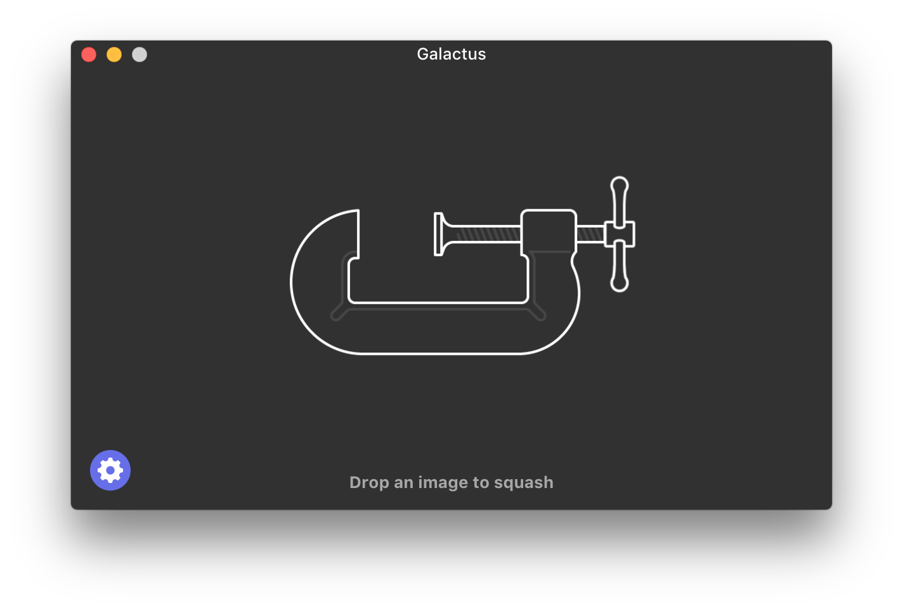
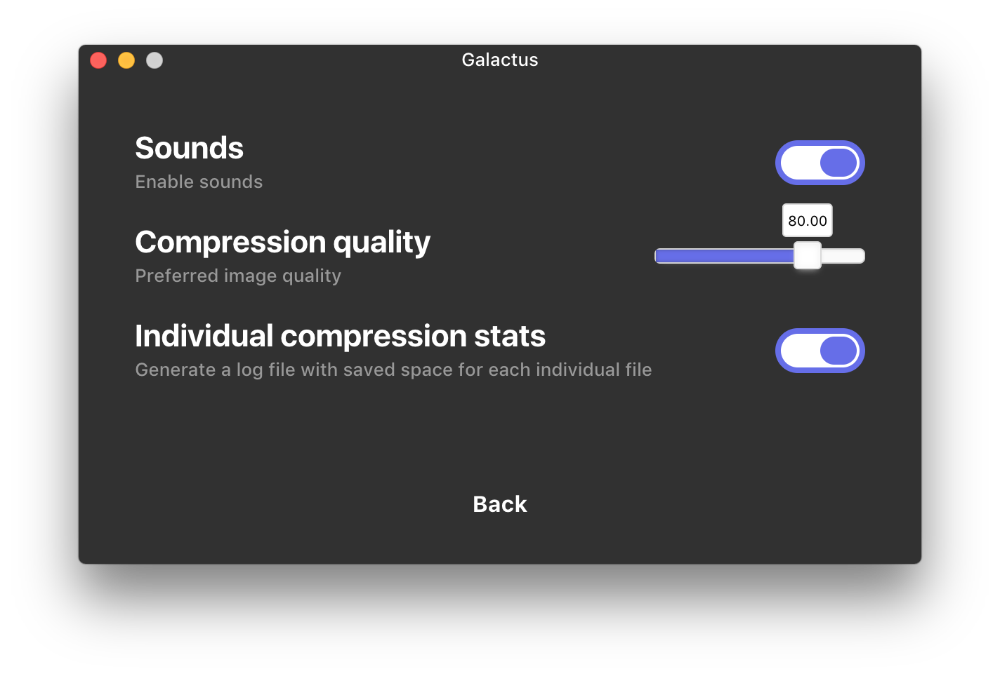

# Galactus 

[](https://travis-ci.org/JensDebergh/Galactus)
[](https://ci.appveyor.com/project/JensDebergh/galactus)


> Elegant compression desktop app

Galactus is a compression app with many useful features, free and open source!
Optimize images for the web or just decrease the overall file size to save some space on that ol' harddrive.

**[Discuss it on Product Hunt](https://www.producthunt.com/posts/galactus)**

<p align="center">
	<a href="https://github.com/JensDebergh/Galactus/releases/latest">
		
	</a>
</p>


<a href="https://github.com/JensDebergh/Galactus/releases/latest">
	
</a>

<a href="https://github.com/JensDebergh/Galactus/releases/latest">
	
</a>

## Features

- Converts PSD to png
- JPEG support
- PNG support
- SVG optimizer
- File statistics 📈
- Cross-platform ✝
- Silent auto-updates 🆕
- Sounds 🔉
- Touchbar support 🍫 (coming soon)

## Install

*macOS 10.9+, Linux, and Windows 7+ are supported (64-bit only).*

### macOS

[**Download**](https://github.com/JensDebergh/Galactus/releases/latest) the `.dmg` file.

### Linux

[**Download**](https://github.com/JensDebergh/Galactus/releases/latest) the `.AppImage` or `.deb` file.

### Windows

[**Download**](https://github.com/JensDebergh/Galactus/releases/latest) the `.exe` file.

## Dev

Built with [Electron](http://electron.atom.io).

### Run

Using foreman:

```
$ bin/setup
$ foreman s // If using foreman
```

Manual:

```
$ bin/setup
$ npm run start
$ cd app/renderer && npm run start
```

### Build

See the [`electron-builder` docs](https://github.com/electron-userland/electron-builder/wiki/Multi-Platform-Build).

### Publish

```
$ npm run dist
```

## Maintainers

- [Jens Debergh](https://jensdebergh.be)

## Disclaimer

Most assets in this app are shamingly 😞 stolen from [Squash](https://www.realmacsoftware.com/squash/) an amazing compression app for mac. All rights reserved to the original owners.

Galactus is a third-party app and is not affiliated with [Squash](https://www.realmacsoftware.com/squash/).

<a href="https://github.com/JensDebergh/Galactus/releases/latest">
	
</a>

## License

MIT